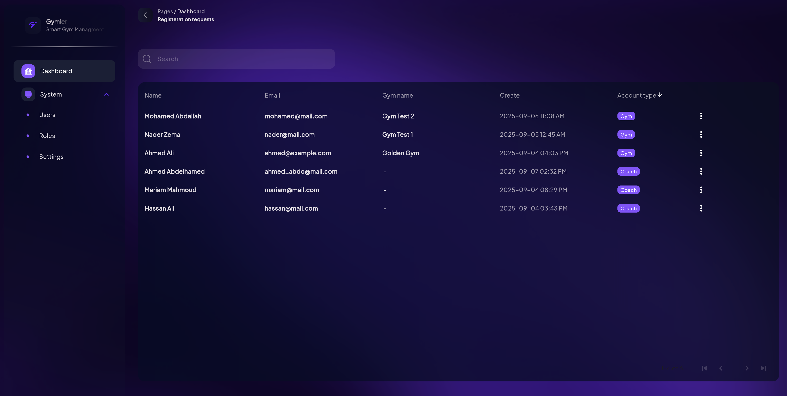
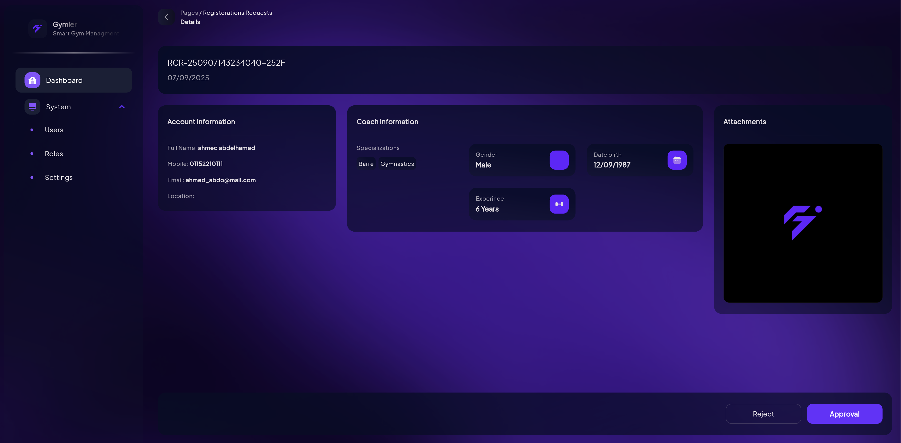
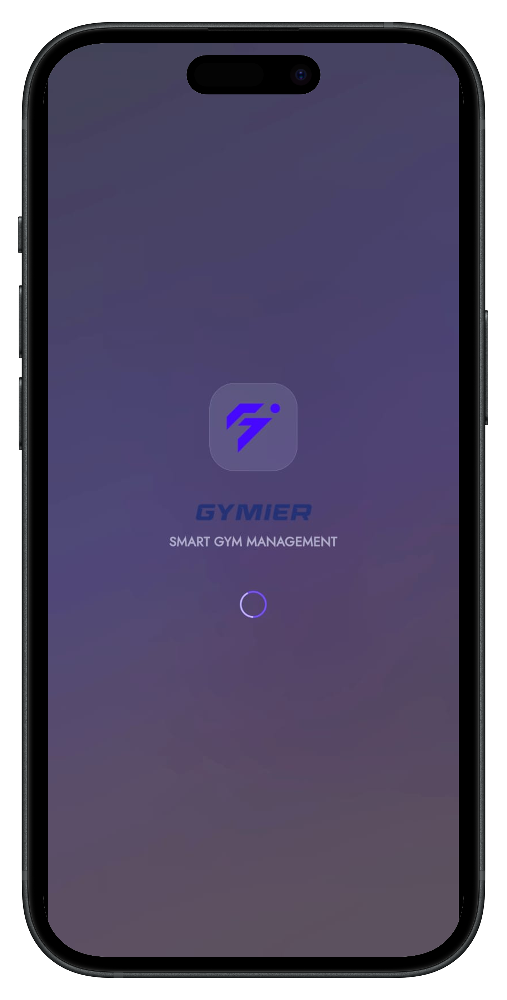
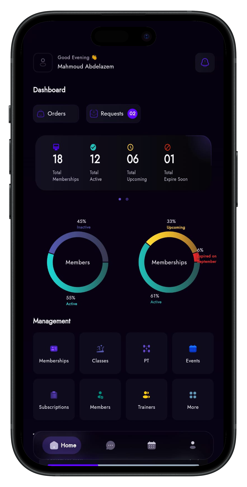
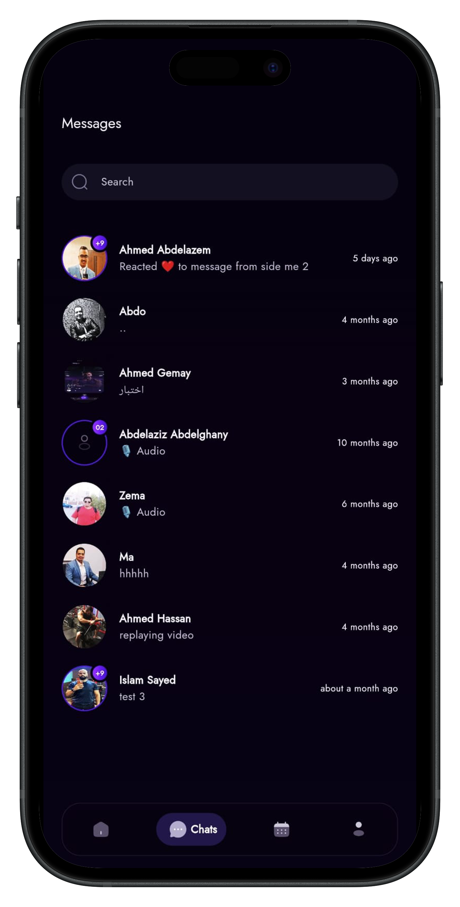
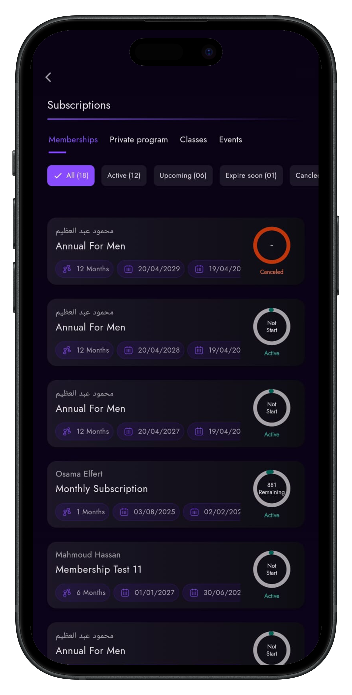
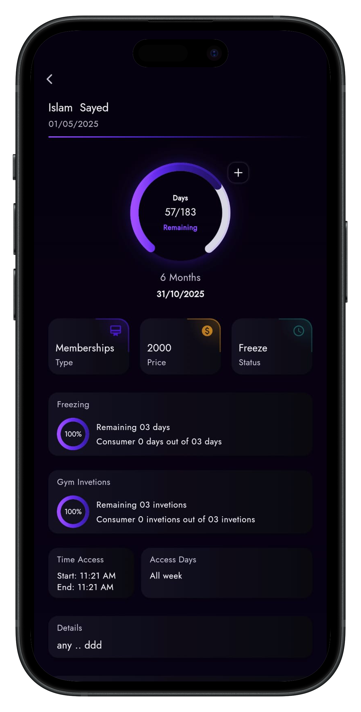
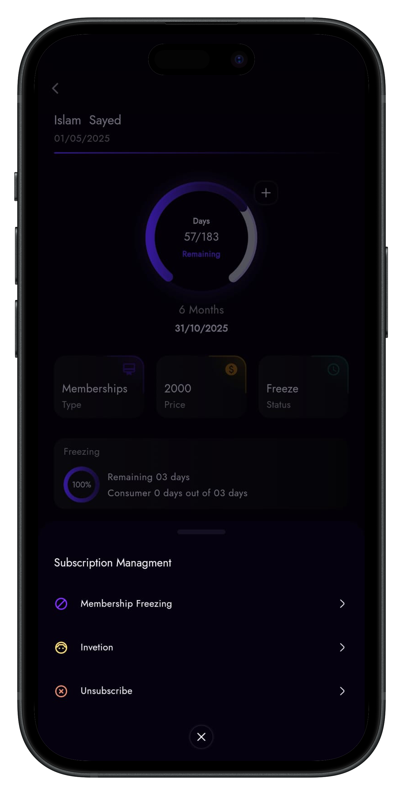
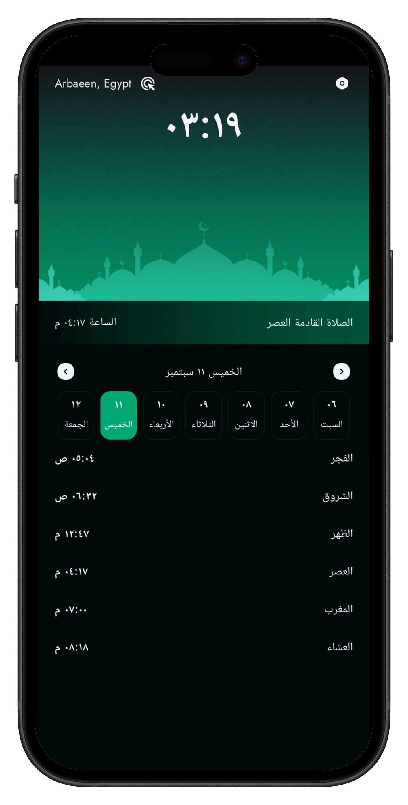
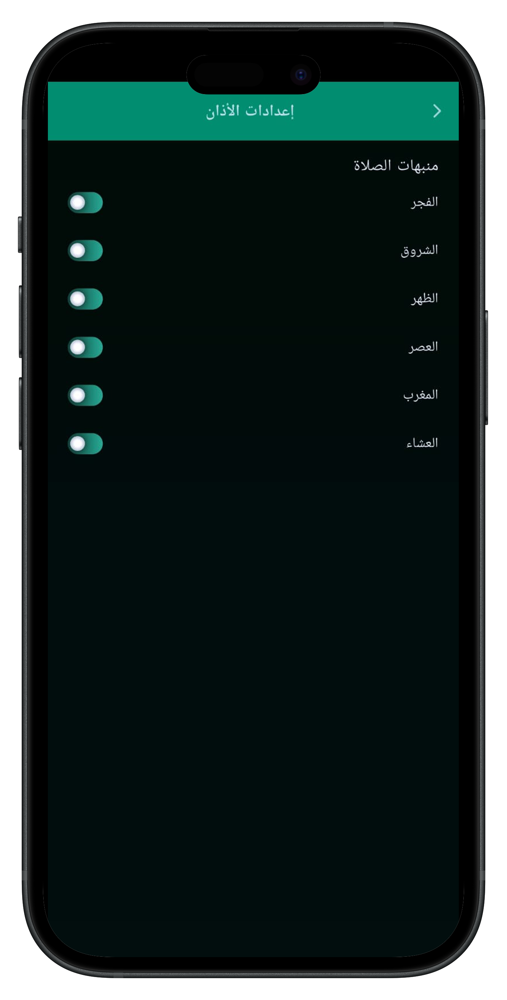

# Hi 👋, I'm Mahmoud Abdelazem

💻 **Flutter & Mobile Developer | Software Engineer | System Support Engineer | IT Specialist**

---

## 🔥 Featured Projects

### 🕌 Gymier Platform
A gym management system (attendance, subscriptions, and progress tracking).  
- 📌 Flutter, Firebase, Firestore Sync, Hive Cache  
- 📷 Screenshots:  

  

  
  

---

### 🕌 Gymier Gym
A gym management system (attendance, subscriptions, and progress tracking).  
- 📌 Flutter, Firebase, Firestore Sync, Hive Cache  
- 📷 Screenshots:  

  

  
  
  

  
  
  

---

### 🕌 Azan App
Prayer times app with Adhan notifications and Qibla direction.  
- 📌 Flutter, Native Android Integration, Notifications
- 📷 Screenshots:  

  
  

- [🔗 View on GitHub](https://github.com/ma-abdelazem/azan-app-flutter)

---

### 👨‍💻 About Me
- 🚀 Passionate about building cross-platform apps with **Flutter**  
- 📱 Focused on **clean architecture, state management, and Firebase**  
- 🔧 12+ years of IT experience (System Admin, IT Specialist, Technical Support)  
- 🌍 Based in **Egypt**, open to remote opportunities  

---

### 🛠️ Tech Stack
- **Mobile Development**: Flutter, Dart  
- **Backend**: Firebase, Node.js, MongoDB  
- **Tools**: Git, GitHub, VS Code, Android Studio  
- **Other Skills**: System Administration, Networking, IT Support 

---

### 📫 Connect with Me
- Email: ma7.abdelazem@gmail.com  
- GitHub: https://github.com/ma-abdelazem  

<!--
**ma-abdelazem/ma-abdelazem** is a ✨ _special_ ✨ repository because its `README.md` (this file) appears on your GitHub profile.

Here are some ideas to get you started:

- 🔭 I’m currently working on ...
- 🌱 I’m currently learning ...
- 👯 I’m looking to collaborate on ...
- 🤔 I’m looking for help with ...
- 💬 Ask me about ...
- 📫 How to reach me: ...
- 😄 Pronouns: ...
- ⚡ Fun fact: ...
-->
